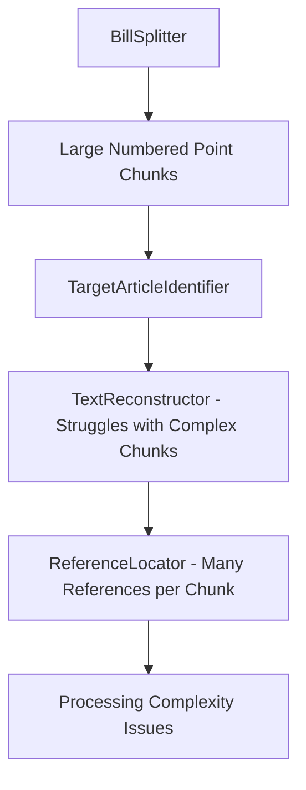

# Lettered Subdivision Splitting Enhancement Specification

## 1. Executive Summary

### 1.1 Problem Statement

The current `BillSplitter` component splits legislative bills at the **numbered point level** (1°, 2°, 3°, etc.), creating chunks that are often too large and complex for optimal downstream processing. This leads to:

- **TextReconstructor struggles**: Complex numbered point chunks contain multiple lettered subdivisions with compound amendment operations, causing LLM reconstruction failures
- **Reference processing complexity**: Large chunks contain many references, degrading the quality of reference location and linking
- **Reduced processing granularity**: Error isolation and debugging become difficult with oversized chunks
- **Suboptimal LLM performance**: Complex, multi-operation chunks exceed the optimal complexity threshold for reliable LLM processing

### 1.2 Proposed Solution

**Shift the atomic splitting level from numbered points to lettered subdivisions** while maintaining target article inheritance through a two-phase parsing approach:

1. **Phase 1**: Parse numbered point headers to extract target article information
2. **Phase 2**: Split lettered subdivisions and inherit target article context

This approach aligns with the **semantic reality** of French legislative amendments, where:

- **Numbered points** are structural headers declaring intent ("L'article X est ainsi modifié")
- **Lettered subdivisions** contain the actual atomic legal operations ("les mots A sont remplacés par les mots B")

### 1.3 Expected Benefits

- **Improved TextReconstructor accuracy**: Smaller, simpler chunks with single operations
- **Enhanced reference processing**: Fewer references per chunk, cleaner detection and linking
- **Better error isolation**: Granular failure handling and debugging
- **Increased processing reliability**: Chunks within optimal LLM complexity range
- **Semantic alignment**: Chunks match the actual atomic structure of legal amendments

---

## 2. Current Architecture Analysis

### 2.1 Current Chunking Behavior

**Example from `full_legislative_bill.md`:**

```
2° L'article L. 254-1 est ainsi modifié :
    a) (nouveau) Au 3° du II, les mots : « prévu aux articles L. 254-6-2 et L. 254-6-3 » sont remplacés par les mots : « à l'utilisation des produits phytopharmaceutiques » ;
    b) Le VI est ainsi modifié :
        - à la fin de la première phrase, les mots : « incompatible avec celui des activités mentionnées aux 1° ou 2° du II ou au IV » sont remplacés par les mots : « interdit aux producteurs au sens du 11 de l'article 3 du règlement (CE) n° 1107/2009... » ;
        - la seconde phrase est supprimée ;
```

**Current chunking creates 1 chunk:**

- **Chunk ID**: `TITRE_1::Article_1::2°`
- **Text**: Contains entire numbered point (header + all lettered subdivisions)
- **Operations**: 3 distinct amendment operations in a single chunk
- **Complexity**: High - multiple references, compound operations

**Proposed chunking creates 2 chunks:**

- **Chunk 1**: `TITRE_1::Article_1::2°::a)` - Single operation, simple
- **Chunk 2**: `TITRE_1::Article_1::2°::b)` - Single operation, manageable complexity

### 2.2 Current Component Flow



### 2.3 Impact on Existing Components

**Components Requiring Updates:**

- ✅ `BillSplitter` - Major enhancement (splitting logic)
- ✅ `models.py` - Minor update (add lettered subdivision field)
- ✅ `TargetArticleIdentifier` - Minor update (handle inherited targets)
- ✅ Tests - Update test expectations

**Components Benefiting Immediately:**

- ✅ `TextReconstructor` - Simpler chunks, better performance
- ✅ `ReferenceLocator` - Fewer references per chunk
- ✅ `ReferenceObjectLinker` - Cleaner grammatical context
- ✅ `Pipeline` - More granular processing and error handling

**Components Unaffected:**

- ✅ `OriginalTextRetriever` - Same article retrieval logic
- ✅ `ResolutionOrchestrator` - Same reference resolution approach
- ✅ `LegalStateSynthesizer` - Same synthesis logic

---

## 3. Detailed Technical Specification

### 3.1 Enhanced Data Model

**File: `bill_parser_engine/core/reference_resolver/models.py`**

```python
@dataclass
class BillChunk:
    """Represents an atomic, processable piece of a legislative bill."""
    text: str
    titre_text: str
    article_label: str
    article_introductory_phrase: Optional[str]
    major_subdivision_label: Optional[str]
    major_subdivision_introductory_phrase: Optional[str]
    numbered_point_label: Optional[str]
    numbered_point_introductory_phrase: Optional[str]  # NEW FIELD
    lettered_subdivision_label: Optional[str]          # NEW FIELD
    hierarchy_path: List[str]
    chunk_id: str
    start_pos: int
    end_pos: int
    cross_references: List[str] = field(default_factory=list)
    target_article: Optional[TargetArticle] = None
    inherited_target_article: Optional[TargetArticle] = None  # NEW FIELD
```

**New Field Definitions:**

- `numbered_point_introductory_phrase`: Text following numbered point header (e.g., "L'article L. 254-1 est ainsi modifié :")
- `lettered_subdivision_label`: The lettered subdivision identifier (e.g., "a)", "b)", "aa)", "aaa)")
- `inherited_target_article`: Target article information extracted from parent numbered point

### 3.2 Enhanced BillSplitter Architecture

**File: `bill_parser_engine/core/reference_resolver/bill_splitter.py`**

#### 3.2.1 New Regex Patterns

```python
class BillSplitter:
    # Existing patterns...
    NUMBERED_POINT_RE = re.compile(r"^[ \t]*(\d+°(?:\s*[A-Za-z]+|\s*bis|\s*ter|\s*quater|\s*quinquies|\s*sexies|\s*septies|\s*octies|\s*nonies|\s*décies)?(?:\s*à\s*\d+°(?:\s*[A-Za-z]+|\s*bis|\s*ter|\s*quater|\s*quinquies|\s*sexies|\s*septies|\s*octies|\s*nonies|\s*décies)?)?(?:\s*\(nouveau\))?)\s*(.*)", re.MULTILINE)

    # NEW: Lettered subdivision pattern
    LETTERED_SUBDIV_RE = re.compile(
        r"^[ \t]*([a-z]+\)|aaa\)|aa\)|[a-z]+ et [a-z]+\))(?:\s*\(nouveau\))?\s*(.*)",
        re.MULTILINE | re.IGNORECASE
    )

    # NEW: Hyphenated sub-operation pattern (for complex lettered subdivisions)
    HYPHENATED_OPERATION_RE = re.compile(
        r"^[ \t]*[-–]\s*(.*)",
        re.MULTILINE
    )
```

#### 3.2.2 Two-Phase Parsing Algorithm

**Phase 1: Target Article Extraction**

```python
def _extract_target_article_from_numbered_point(self, numbered_point_text: str) -> Optional[TargetArticle]:
    """Extract target article information from numbered point header."""
    patterns = [
        (r"L'article\s+([L\.\d\-]+)\s+est\s+ainsi\s+modifié", TargetOperationType.MODIFY),
        (r"Après\s+l'article\s+([L\.\d\-]+),\s+il\s+est\s+inséré", TargetOperationType.INSERT),
        (r"L'article\s+([L\.\d\-]+)\s+est\s+abrogé", TargetOperationType.ABROGATE),
        (r"Au\s+.*\s+de\s+l'article\s+([L\.\d\-]+)", TargetOperationType.MODIFY),
    ]

    for pattern, operation_type in patterns:
        match = re.search(pattern, numbered_point_text, re.IGNORECASE)
        if match:
            return TargetArticle(
                operation_type=operation_type,
                article=match.group(1),
                confidence=0.9,
                raw_text=match.group(0)
            )
    return None
```

**Phase 2: Lettered Subdivision Splitting**

```python
def _split_lettered_subdivisions(self, numbered_point_content: str, inherited_target: Optional[TargetArticle]) -> List[BillChunk]:
    """Split numbered point content into lettered subdivision chunks."""
    lettered_subdivs = list(self.LETTERED_SUBDIV_RE.finditer(numbered_point_content))

    if not lettered_subdivs:
        # No lettered subdivisions - return numbered point as single chunk
        return [self._create_numbered_point_chunk(numbered_point_content)]

    chunks = []
    for idx, subdiv_match in enumerate(lettered_subdivs):
        # Extract lettered subdivision content
        subdiv_label = subdiv_match.group(1).strip()
        subdiv_start = subdiv_match.start()
        subdiv_end = lettered_subdivs[idx + 1].start() if idx + 1 < len(lettered_subdivs) else len(numbered_point_content)
        subdiv_content = numbered_point_content[subdiv_start:subdiv_end].strip()

        # Handle hyphenated sub-operations within lettered subdivisions
        subdiv_content = self._consolidate_hyphenated_operations(subdiv_content)

        # Create chunk with inherited target article
        chunk = BillChunk(
            text=subdiv_content,
            # ... other fields ...
            lettered_subdivision_label=subdiv_label,
            inherited_target_article=inherited_target,
            hierarchy_path=[titre_text, article_label, major_subdivision_label, numbered_point_label, subdiv_label],
            chunk_id="::".join(filter(None, [titre_text, article_label, major_subdivision_label, numbered_point_label, subdiv_label]))
        )
        chunks.append(chunk)

    return chunks
```

#### 3.2.3 Hyphenated Operation Consolidation

```python
def _consolidate_hyphenated_operations(self, lettered_subdiv_content: str) -> str:
    """Consolidate hyphenated sub-operations into coherent text."""
    lines = lettered_subdiv_content.split('\n')
    consolidated_lines = []

    for line in lines:
        line = line.strip()
        if self.HYPHENATED_OPERATION_RE.match(line):
            # This is a hyphenated sub-operation
            operation_text = self.HYPHENATED_OPERATION_RE.match(line).group(1)
            consolidated_lines.append(operation_text)
        else:
            consolidated_lines.append(line)

    return ' '.join(filter(None, consolidated_lines))
```

### 3.3 Enhanced TargetArticleIdentifier

**File: `bill_parser_engine/core/reference_resolver/target_identifier.py`**

```python
def identify(self, chunk: BillChunk) -> TargetArticle:
    """Identify target article, using inherited target if available."""

    # Check for inherited target article first
    if chunk.inherited_target_article:
        logger.debug(f"Using inherited target article for chunk {chunk.chunk_id}")
        return chunk.inherited_target_article

    # Fallback to LLM-based identification for chunks without inheritance
    logger.debug(f"Performing LLM-based target identification for chunk {chunk.chunk_id}")
    return self._llm_identify(chunk)

def _llm_identify(self, chunk: BillChunk) -> TargetArticle:
    """Original LLM-based target identification logic."""
    # Existing implementation...
```

### 3.4 Updated Pipeline Integration

**File: `bill_parser_engine/core/reference_resolver/pipeline.py`**

The pipeline components require minimal changes:

```python
def step_2_identify_target_articles(self) -> List[Dict]:
    """Step 2: Process chunks through TargetArticleIdentifier."""
    # Existing logic works unchanged
    # TargetArticleIdentifier will use inherited targets automatically

def _analyze_target_results(self, results: List[Dict]) -> Dict:
    """Enhanced analysis including inheritance statistics."""
    analysis = {
        # Existing fields...
        'inherited_targets': sum(1 for r in results if r.get('target_article', {}).get('inherited', False)),
        'llm_identified_targets': sum(1 for r in results if not r.get('target_article', {}).get('inherited', False)),
    }
    return analysis
```

---

## 4. Implementation Plan

### 4.1 Phase 1: Data Model Enhancement (1 day)

**Step 1.1: Update BillChunk Model**

- Add `numbered_point_introductory_phrase` field
- Add `lettered_subdivision_label` field
- Add `inherited_target_article` field
- Update existing code to handle new fields

**Step 1.2: Update Serialization Logic**

- Ensure new fields are properly serialized/deserialized
- Update `_chunk_to_dict` and `_dict_to_chunk` methods in pipeline

### 4.2 Phase 2: BillSplitter Enhancement (2-3 days)

**Step 2.1: Add New Regex Patterns**

- Implement `LETTERED_SUBDIV_RE` with comprehensive pattern matching
- Add `HYPHENATED_OPERATION_RE` for sub-operations
- Test patterns against real legislative text examples

**Step 2.2: Implement Target Article Extraction**

- Create `_extract_target_article_from_numbered_point` method
- Handle various French legal amendment patterns
- Include confidence scoring and error handling

**Step 2.3: Implement Two-Phase Splitting Logic**

- Modify main `split` method to use two-phase approach
- Implement `_split_lettered_subdivisions` method
- Add `_consolidate_hyphenated_operations` method
- Ensure fallback behavior for edge cases

**Step 2.4: Update Chunk Creation Logic**

- Modify all `BillChunk` instantiations to use new fields
- Ensure proper hierarchy path construction
- Implement robust chunk ID generation

### 4.3 Phase 3: Component Updates (1 day)

**Step 3.1: Enhance TargetArticleIdentifier**

- Add inherited target article handling
- Maintain fallback to LLM identification
- Update logging and diagnostics

**Step 3.2: Update Pipeline Analytics**

- Enhance target analysis to include inheritance statistics
- Add chunk size distribution analysis
- Update result reporting

### 4.4 Phase 4: Testing and Quality Assurance (2 days)

**Step 4.1: Unit Test Updates**

- Update existing BillSplitter tests for new chunking behavior
- Add comprehensive tests for lettered subdivision splitting
- Test target article inheritance scenarios

**Step 4.2: Integration Testing**

- Test full pipeline with new chunking approach
- Verify TextReconstructor performance improvements
- Validate reference processing accuracy

**Step 4.3: Regression Testing**

- Ensure backward compatibility where possible
- Test with diverse legislative text examples
- Validate chunk ID uniqueness and hierarchy consistency
