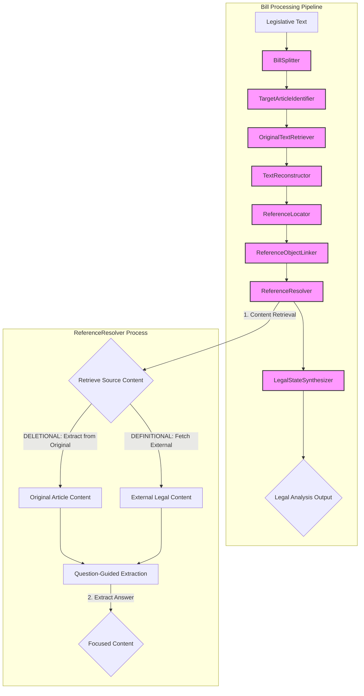

# Normative Reference Resolver: Detailed Specifications

## 1. Overview

The Normative Reference Resolver is a key component of the bill-parser-engine that processes legislative text, identifies normative references, and resolves them through question-guided content extraction to produce a fully interpretable, self-contained version of the text. The system leverages LLM agents for core processing tasks while maintaining a robust architecture that focuses on targeted resolution rather than complex orchestration.

### 1.1 French Legislative Bill Hierarchy Structure

French legislative bills follow a well-defined hierarchical structure, which is essential for both parsing and reference resolution. The main levels are:

1. **Document Header**: Contains metadata such as bill number, session, date, and introductory statements.
2. **TITRE (Title)**: Thematic divisions grouping related articles (e.g., "TITRE Iᴱᴿ").
3. **Article**: The primary logical unit (e.g., "Article 1ᵉʳ").
4. **Major Subdivision**: Roman numerals (I, II, III, etc.) for large sections within an article (may be absent).
5. **Numbered Point**: Arabic numerals with degree sign (1°, 2°, 3°, etc.) for atomic legal provisions within a subdivision or article. This is the atomic level for splitting.
6. **Lettered Subdivision**: Lowercase letters (a), b), c), etc.) for further breakdown within a numbered point.
7. **Indented/Hyphenated Text**: Additional detail, often using hyphens or indentation, for lists or clarifications.

**Reference Tracking and Context Preservation:**

- Each atomic unit (numbered point) must retain its full hierarchical path (TITRE > Article > Subdivision > Numbered Point) for context.
- Cross-references (e.g., "du même article", "au 3° du II") require a mapping between units and their positions in the hierarchy.
- When splitting, metadata about parent TITRE, Article, and all ancestor levels must be preserved for each chunk.

### 1.2 The Lawyer's Mental Model: A Guiding Principle

The entire architecture of this system is designed to replicate the methodical and efficient workflow of an expert legal analyst. A lawyer does not read a legislative amendment in isolation; they interpret it as a precise set of instructions for modifying an existing legal document. Our pipeline is a direct reflection of this mental model.

The core principles of this model are:

1.  **The Goal is the "Diff"**: The ultimate objective is not to produce a single, flattened text, but to generate a clear, comparative analysis of the law **before** and **after** the amendment. The final output must be two distinct, fully-resolved states: the `BeforeState` and the `AfterState`.

2.  **Analysis is Amendment-Driven**: A lawyer's analysis is targeted. They start with the specific change described in the amendment and only pull in context from the original law as it becomes necessary to understand that change. They do not waste time analyzing parts of the original law that are unaffected. Our pipeline reflects this by starting with the `AmendmentChunk` and using the original law as a lookup resource.

3.  **Structure Precedes Semantics**: Before analyzing the meaning of references, a lawyer first understands the structural changes. They mechanically apply the deletions, replacements, and insertions to form a clear picture of the new text's structure. Our `TextReconstructor` component models this crucial, rule-based first step.

4.  **Analysis Involves Micro-Tasks**: Identifying a reference and understanding its connection to the text are two distinct cognitive tasks.
    - **Spotting (Perception)**: Rapidly identifying patterns that look like references.
    - **Linking (Cognition)**: Carefully analyzing grammar and context to link the reference to its specific object.
      Our pipeline mirrors this with the separate `ReferenceLocator` and `ReferenceObjectLinker` components.

By adhering to this model, we ensure each component has a simple, well-defined purpose, which is essential for building a robust and accurate system, especially one that leverages Large Language Models for complex cognitive tasks.

#### Example: Step-by-Step Legal Analysis

Suppose the bill contains the following amendment:

> b) Le VI est ainsi modifié :
>
> - à la fin de la première phrase, les mots : « incompatible avec celui des activités mentionnées aux 1° ou 2° du II ou au IV » sont remplacés par les mots : « interdit aux producteurs au sens du 11 de l'article 3 du règlement (CE) n° 1107/2009 du 21 octobre 2009, sauf lorsque la production concerne des produits de biocontrôle figurant sur la liste mentionnée à l'article L. 253-5 du présent code, des produits composés uniquement de substances de base au sens de l'article 23 du règlement (CE) n° 1107/2009 ou de produits à faible risque au sens de l'article 47 du même règlement (CE) n° 1107/2009 et des produits dont l'usage est autorisé dans le cadre de l'agriculture biologique » ;

A lawyer's workflow, and the corresponding pipeline steps, would be:

1. **Retrieve the Original Law**: Find the current text of Article L. 254-1, VI.
2. **Mechanically Apply the Amendment** (`TextReconstructor`):
   - Remove the phrase `incompatible avec celui des activités mentionnées aux 1° ou 2° du II ou au IV`.
   - Insert the new, long phrase in its place.
   - The result is two texts: the deleted phrase ("before"), and the new phrase ("after").
3. **Spot References** (`ReferenceLocator`):
   - In the deleted phrase: spot `aux 1° ou 2° du II` and `au IV` (tagged as DELETIONAL).
   - In the new phrase: spot `du 11 de l'article 3 du règlement (CE) n° 1107/2009`, `à l'article L. 253-5`, `au sens de l'article 23 du règlement (CE) n° 1107/2009`, `au sens de l'article 47 du même règlement (CE) n° 1107/2009` (tagged as DEFINITIONAL).
4. **Link References to Objects** (`ReferenceObjectLinker`):
   - For each DELETIONAL reference, use the original law as context to find the object (e.g., "activités").
   - For each DEFINITIONAL reference, use the new phrase as context to find the object (e.g., "producteurs", "la liste", etc.).
5. **Resolve References** (`ReferenceResolver`):
   - Use question-guided extraction to fetch the specific content that answers questions about each referenced object.
6. **Synthesize Final States** (`LegalStateSynthesizer`):
   - Substitute the resolved content into the original and new texts to produce the fully interpretable `BeforeState` and `AfterState`.

This example illustrates how the pipeline mirrors the lawyer's real-world workflow, ensuring both accuracy and efficiency.

## 2. System Architecture & Pipeline

The system is designed as a multi-stage pipeline where a legislative bill is progressively enriched with metadata until a fully resolved, self-contained version of the text is produced. The `ReferenceResolver` performs focused, question-guided content extraction to provide precisely the information needed for accurate legal state synthesis.

### 2.1 Visual Pipeline



### 2.2 Processing Steps

1.  **Input**: Receive legislative text.
2.  **Bill Splitting**: `BillSplitter` parses the text into atomic `BillChunk`s.
3.  **Target Article Identification**: `TargetArticleIdentifier` infers the legal article being modified.
4.  **Original Text Retrieval**: `OriginalTextRetriever` fetches the current text of the target article.
5.  **Text Reconstruction (NEW)**: A new, rule-based `TextReconstructor` mechanically applies the amendment to the original text. It outputs two clean strings: the exact `DeletedOrReplacedText` and the `IntermediateAfterStateText` (the full text after the change, but before reference resolution).
6.  **Reference Locating**: The `ReferenceLocator` scans _only_ the `DeletedOrReplacedText` and `IntermediateAfterStateText` to find all reference strings, tagging them as `DELETIONAL` or `DEFINITIONAL`. This completely replaces the need for a separate `ReferenceFunctionalAnalysis` step.
7.  **Reference-Object Linking**: The `ReferenceObjectLinker` takes each located reference and uses the appropriate context (original text for `DELETIONAL`, intermediate "after" text for `DEFINITIONAL`) to link it to its grammatical object.
8.  **Question-Guided Resolution**: `ReferenceResolver` uses targeted extraction to resolve linked references based on specific questions about referenced objects.
9.  **Legal State Synthesis**: `LegalStateSynthesizer` performs the final substitution, populating the original and intermediate texts with their resolved content to produce the final `BeforeState` and `AfterState`.
10. **Output**: The `LegalAnalysisOutput` provides the two fully resolved legal states for comparison.

## 3. Core Component Specifications

This section provides detailed specifications for each component in the pipeline.

### 3.1 BillSplitter

**Component**: `BillSplitter`

**Implementation**: Rule-based parsing (no LLM)

**Responsibility**: Deterministically split the legislative bill into atomic, manageable pieces for downstream LLM processing, following the legal document's hierarchy. The splitting logic is strictly rule-based (not LLM-powered) and ensures robust context and reference tracking.

**Inputs**:

- `legislative_text` (string): The raw text of the legislative bill.

**Outputs**:

- A list of `BillChunk` objects, where each object contains:
  - `text` (string): The content of the numbered point or major subdivision.
  - `titre_text` (string): The full TITRE (Title) heading.
  - `article_label` (string): The Article number and heading.
  - `article_introductory_phrase` (string or null): The phrase immediately following the Article heading.
  - `major_subdivision_label` (string or null): The Roman numeral and its heading/phrase.
  - `major_subdivision_introductory_phrase` (string or null): The phrase immediately following the major subdivision heading.
  - `numbered_point_label` (string or null): The label of the numbered point.
  - `hierarchy_path` (list of strings): All parent headings/identifiers in order.
  - `chunk_id` (string): Unique identifier for the chunk.
  - `start_pos` (integer): Character position in the original text.
  - `end_pos` (integer): Character position in the original text.
  - `cross_references` (list of strings, optional): List of detected references to other units.

**Splitting Rules (Hierarchical and Deterministic):**

1. **For each Article:**

   - Identify the `article_introductory_phrase`: the text immediately following the Article heading, before any major subdivision or numbered point. This may be empty if not present.
   - **If the Article contains direct child numbered points (1°, 2°, etc.):**
     - Each numbered point becomes a chunk.
     - Each chunk's context includes the `article_introductory_phrase`.
   - **If the Article contains direct child major subdivisions (Roman numerals: I, II, etc.):**
     - For each major subdivision:
       - Identify the `major_subdivision_introductory_phrase`: the text immediately following the major subdivision heading, before any numbered point. This may be empty if not present.
       - **If the major subdivision contains numbered points:**
         - Each numbered point within the major subdivision becomes a chunk.
         - Each chunk's context includes both the `article_introductory_phrase` and the `major_subdivision_introductory_phrase`.
       - **If the major subdivision contains no numbered points:**
         - The entire major subdivision becomes a single chunk.
         - Its context includes the `article_introductory_phrase` and the `major_subdivision_introductory_phrase`.
   - **If the Article contains neither direct child numbered points nor major subdivisions:**
     - The entire Article content becomes a single chunk.
     - Its context is the `article_introductory_phrase` (if any).

2. **Handling Numbered Point Ranges:**

   - If a range is specified (e.g., "1° à 3° (Supprimés)"), treat the entire range as a single chunk. The `numbered_point_label` should be the full range (e.g., "1° à 3°").
   - The chunk's text is the content following the range label (e.g., "(Supprimés)").

3. **Introductory Phrase Handling:**

   - Always capture both `article_introductory_phrase` and, if applicable, `major_subdivision_introductory_phrase` as separate fields in the metadata.
   - These phrases provide essential legal context (e.g., which code is being amended) and must be preserved for all child chunks.

4. **Parent Metadata for Each Chunk (Explicit Field Definitions):**

   - `titre_text`: The full TITRE (Title) heading under which the Article appears.
   - `article_label`: The Article number and heading (e.g., "Article 2").
   - `article_introductory_phrase`: The phrase immediately following the Article heading (may be empty).
   - `major_subdivision_label`: The Roman numeral and its heading/phrase, if present (e.g., "I.", "II (nouveau)."), otherwise null.
   - `major_subdivision_introductory_phrase`: The phrase immediately following the major subdivision heading (may be empty).
   - `numbered_point_label`: The label of the numbered point (e.g., "1°", "2°", "1° à 3°"), if present, otherwise null.
   - `hierarchy_path`: List of all parent headings/identifiers in order (e.g., [TITRE, Article, Major Subdivision, Numbered Point]).
   - `chunk_id`: Unique identifier for the chunk (e.g., concatenation of TITRE, Article, subdivision, and point numbers/labels).
   - `start_pos`, `end_pos`: Character positions in the original text.
   - `cross_references`: (Optional) List of detected references to other units for advanced tracking.

5. **Chunk Content:**

   - The chunk's `text` is the full content of the numbered point or major subdivision, including any lettered subpoints (a), b), etc.) and indented/hyphenated lists that belong to it.
   - **Do not** include parent headings or introductory phrases as a preamble in the chunk text. All context must be provided via metadata fields.

6. **Special Markings:**

   - Labels such as "(nouveau)", "(Supprimé)" must be included as part of the relevant label fields (e.g., `article_label`, `major_subdivision_label`, `numbered_point_label`) or as part of the chunk text, as they appear in the source.

7. **Extremely Long Chunks:**

   - If a chunk exceeds a practical token limit (e.g., >2000 tokens), consider further splitting at lettered subpoints (a), b), etc.), but only as a last resort and never across parent boundaries.

8. **Examples:**

   - **Article with direct numbered points:**
     - Article 1: `article_introductory_phrase` + 1°, 2°, 3°, ...
     - Each chunk = one numbered point, with parent metadata including the introductory phrase.
   - **Article with major subdivisions containing numbered points:**
     - Article 2: I. (`major_subdivision_introductory_phrase` + 1°, 2°, ...), II. (...)
     - Each chunk = one numbered point within a major subdivision, with full parent metadata.
   - **Article with only major subdivisions (no numbered points):**
     - Article 4: I., II., III.
     - Each chunk = one major subdivision, with parent metadata.
   - **Article with neither:**
     - Article X: Just a paragraph of text
     - Single chunk, with parent metadata.
   - **Numbered point range:**
     - "1° à 3° (Supprimés)" is a single chunk, with `numbered_point_label` = "1° à 3°" and text = "(Supprimés)".

9. **Implementation Notes:**

   - Use regular expressions or a state machine to detect TITREs, Articles, introductory phrases, major subdivisions (Roman numerals), and numbered points (1°, 2°, etc.).
   - Always associate each chunk with its full parent context for accurate reference resolution.
   - Never use an LLM for this splitting step; deterministic parsing is required for reliability and reproducibility.

10. **Integration:**
    - The BillSplitter is the first step in the pipeline, preceding reference detection.
    - Downstream components (ReferenceLocator, etc.) operate on these atomic chunks.

### 3.2 TargetArticleIdentifier

**Component**: `TargetArticleIdentifier`

**Implementation**: Mistral Chat API (JSON Mode)

**Responsibility**: For each chunk, infer the primary legal article, section, or code provision that is the _target_ of the modification, insertion, or abrogation described in the chunk.

**Inputs**:

- `bill_chunk` (BillChunk object): A single chunk from the `BillSplitter`, containing the text and metadata of a numbered point or major subdivision.

**Outputs**:

- A JSON object with the following fields:
  - `operation_type` (string): One of "INSERT", "MODIFY", "ABROGATE", "RENUMBER", or "OTHER".
  - `code` (string or null): The code being modified (e.g., "code rural et de la pêche maritime").
  - `article` (string or null): The article identifier (e.g., "L. 411-2-2").
  - `confidence` (float): A number between 0 and 1 indicating confidence.
  - `raw_text` (string or null): The exact phrase in the chunk that led to this inference.

**API Strategy**: **JSON Mode**. The task is to extract a single, structured `TargetArticle` object with a relatively simple schema. JSON Mode is sufficient and efficient here because the output schema is straightforward and doesn't require precise character positions.

**Prompt Focus**: The prompt should clearly describe the target fields (`operation_type`, `code`, `article`, etc.) and provide 2-3 examples covering different operations (INSERT, MODIFY, ABROGATE).

**Example API Usage**:

```python
from mistralai.client import MistralClient
from mistralai.models.chat_completion import ChatMessage
import os
import json

client = MistralClient(api_key=os.getenv("MISTRAL_API_KEY"))

system_prompt = """
You are a legal bill analysis agent. Your task is to identify the main legal article, section, or code provision that is the *target* of the modification, insertion, or abrogation described in the given chunk of legislative text.

Return a JSON object with the following fields:
- operation_type: One of "INSERT", "MODIFY", "ABROGATE", "RENUMBER", or "OTHER"
- code: The code being modified (e.g., "code rural et de la pêche maritime") or null if none
- article: The article identifier (e.g., "L. 411-2-2") or null if none
- confidence: A number between 0 and 1 indicating your confidence
- raw_text: The exact phrase in the chunk that led to this inference, or null if none

EXAMPLE:
Chunk: "7° (nouveau) Après l'article L. 411-2-1, il est inséré un article L. 411-2-2 ainsi rédigé : ..."
Output:
{
  "operation_type": "INSERT",
  "code": "code de l'environnement",
  "article": "L. 411-2-2",
  "confidence": 0.98,
  "raw_text": "il est inséré un article L. 411-2-2"
}
"""

chunk_text = "7° (nouveau) Après l'article L. 411-2-1, il est inséré un article L. 411-2-2 ainsi rédigé : ..."

response = client.chat(
    model="mistral-large-latest",
    temperature=0.0,
    messages=[
        ChatMessage(role="system", content=system_prompt),
        ChatMessage(role="user", content=chunk_text)
    ],
    response_format={"type": "json_object"}
)
target_article = json.loads(response.choices[0].message.content)
```

### 3.3 OriginalTextRetriever

**Component**: `OriginalTextRetriever`

**Implementation**: Hybrid approach combining direct API integration (using `pylegifrance`) with web search fallback.

**Responsibility**: Fetch the current/existing text of the target article identified by `TargetArticleIdentifier`. This is **critical** because reference objects may only be visible in the original law, not in the amendment text. Without this context, the `ReferenceObjectLinker` cannot properly identify what concepts/objects the references in deleted text refer to.

**Inputs**:

- `target_article` (JSON object): The output from `TargetArticleIdentifier`, containing `operation_type`, `code`, `article`, `confidence`, and `raw_text`.

**Outputs**:

- `original_law_article` (string): The full text of the target article with proper segmentation (maintaining hierarchy: I, II, 1°, 2°, etc.). For INSERT operations where the article doesn't exist yet, returns empty string.
- `retrieval_metadata` (JSON object): Contains retrieval status, source, and any error information.

**Core Logic**:

1. Receive `TargetArticle` metadata from `TargetArticleIdentifier`
2. Use the identified code and article (e.g., "code rural et de la pêche maritime", "L. 254-1") to fetch the current legal text
3. Return the full article text with proper segmentation (maintaining hierarchy: I, II, 1°, 2°, etc.)
4. Handle cases where target articles don't exist yet (for INSERT operations)

**Example Workflow**:

```python
# Input from TargetArticleIdentifier
target = TargetArticle(
    operation_type=TargetOperationType.MODIFY,
    code="code rural et de la pêche maritime",
    article="L. 254-1",
    confidence=0.95
)

# Fetch original text
original_text = retriever.fetch_article_text(
    code="code rural et de la pêche maritime",
    article="L. 254-1"
)

# Returns structured text like:
# "Article L. 254-1
# I. - ...
# II. - ...
# 1° ...
# 2° ...
# 3° Le conseil prévu aux articles L. 254-6-2 et L. 254-6-3..."
```

**Error Handling**: For articles that don't exist (INSERT operations), return empty text with appropriate metadata.

### 3.4 TextReconstructor

**Component**: `TextReconstructor`

**Implementation**: LLM-based (Mistral API, **JSON Mode**)

**Responsibility**: Given the `OriginalLawArticle` text and an `AmendmentChunk`, deterministically apply the amendment instructions using an LLM and output two clean text fragments.

**Inputs**:

- `original_law_article` (string): The full text of the target article from `OriginalTextRetriever`.
- `amendment_chunk` (BillChunk object): A single chunk containing the amendment instructions.

**Outputs**:

- A JSON object with two required fields:
  - `deleted_or_replaced_text` (string): The exact text that was removed or replaced from the original.
  - `intermediate_after_state_text` (string): The full text of the article after the modifications have been applied, but before reference resolution.

**API Strategy**:

- Use the Mistral Chat API in **JSON Mode** (not function calling mode).
- The LLM must return a single JSON object with two required fields:
  - `deleted_or_replaced_text` (string): The exact text that was deleted or replaced.
  - `intermediate_after_state_text` (string): The full text of the article after the amendment is applied.

**Prompt Construction**:

- The system prompt must clearly instruct the LLM to:
  - Mechanically apply the amendment to the original article, with no interpretation or reference resolution.
  - Output only the two required fields in a JSON object.
  - Use deterministic logic (no creative rewriting).
- The user message must provide:
  - The full original article text.
  - The amendment instruction(s).
- The prompt must include at least two real amendment examples, showing the expected before/after fragments and the required JSON output.

**Example API Usage**:

```python
from mistralai.client import MistralClient
from mistralai.models.chat_completion import ChatMessage
import os
import json

client = MistralClient(api_key=os.getenv("MISTRAL_API_KEY"))

system_prompt = """
You are a legal text amendment agent. Given the original article and an amendment instruction, mechanically apply the amendment and return a JSON object with:
- deleted_or_replaced_text: the exact text that was deleted or replaced (string)
- intermediate_after_state_text: the full text of the article after the amendment (string)

Do not resolve references or interpret the law. Only apply the amendment as written.

EXAMPLE 1:
Original article: "VI. – L'exercice de l'activité de conseil à l'utilisation des produits phytopharmaceutiques est incompatible avec celui des activités mentionnées aux 1° ou 2° du II ou au IV. La prestation de conseil est formalisée par écrit."
Amendment: "à la fin de la première phrase, les mots : « incompatible avec celui des activités mentionnées aux 1° ou 2° du II ou au IV » sont remplacés par les mots : « interdit aux producteurs au sens du 11 de l'article 3 du règlement (CE) n° 1107/2009... » ; la seconde phrase est supprimée ;"
Output:
{
  "deleted_or_replaced_text": "incompatible avec celui des activités mentionnées aux 1° ou 2° du II ou au IV. La prestation de conseil est formalisée par écrit.",
  "intermediate_after_state_text": "VI. – L'exercice de l'activité de conseil à l'utilisation des produits phytopharmaceutiques est interdit aux producteurs au sens du 11 de l'article 3 du règlement (CE) n° 1107/2009..."
}

EXAMPLE 2:
Original article: "Article L. 254-1. – I. – Le conseil est obligatoire. II. – Les modalités sont fixées par décret."
Amendment: "Au II, les mots : « Les modalités sont fixées par décret. » sont remplacés par les mots : « Les modalités sont fixées par arrêté. »"
Output:
{
  "deleted_or_replaced_text": "Les modalités sont fixées par décret.",
  "intermediate_after_state_text": "Article L. 254-1. – I. – Le conseil est obligatoire. II. – Les modalités sont fixées par arrêté."
}
"""

response = client.chat(
    model="mistral-large-latest",
    temperature=0.0,
    messages=[
        ChatMessage(role="system", content=system_prompt),
        ChatMessage(role="user", content=json.dumps({
            "original_article": "...",
            "amendment": "..."
        }))
    ],
    response_format={"type": "json_object"}
)
result = json.loads(response.choices[0].message.content)
```

**Best Practices**:

- Always use `temperature=0` for deterministic output.
- Validate that the returned JSON object contains both required fields and that the amendment was applied mechanically.
- Log all LLM outputs for review and prompt improvement.
- If the LLM is uncertain or cannot apply the amendment, it must return a warning or flag in a dedicated field (e.g., `"warning": "Could not apply amendment"`).

**Testing and Validation**:

- Test the component with a diverse set of real amendment instructions, including edge cases (multiple replacements, deletions, insertions, and ambiguous instructions).
- Ensure the output is always a valid JSON object with the required fields.

### 3.5 ReferenceLocator

**Component**: `ReferenceLocator`

**Implementation**: LLM-based (Mistral API, **JSON Mode**)

**Responsibility**: Given the `DeletedOrReplacedText` and `IntermediateAfterStateText` produced by the `TextReconstructor`, use an LLM to identify all normative references in each fragment and output a structured list of located references, each tagged with its source (DELETIONAL or DEFINITIONAL).

**Inputs**:

- `deleted_or_replaced_text` (string): The text fragment that was deleted or replaced from the original law (from `TextReconstructor`).
- `intermediate_after_state_text` (string): The text fragment representing the article after the amendment (from `TextReconstructor`).

**Outputs**:

- A JSON object with a single field:
  - `located_references` (list of objects), where each object contains:
    - `reference_text` (string): The exact reference phrase as it appears in the text.
    - `start_position` (integer): Start character index of the reference in the relevant text fragment.
    - `end_position` (integer): End character index (exclusive) of the reference in the relevant text fragment.
    - `source` (string): Either `DELETIONAL` (if found in `deleted_or_replaced_text`) or `DEFINITIONAL` (if found in `intermediate_after_state_text`).
    - `confidence` (float): Confidence score between 0 and 1.

**API Strategy**:

- Use the Mistral Chat API in **JSON Mode** (not function calling mode).
- The LLM must return a single JSON object with the required `located_references` field as described above.

**Prompt Construction**:

- The system prompt must clearly instruct the LLM to:
  - Identify all normative references (to articles, codes, regulations, decrees, etc.) in both input fragments.
  - For each reference, return the exact phrase, its character positions, the source (DELETIONAL or DEFINITIONAL), and a confidence score.
  - Output only the required JSON object.
- The user message must provide:
  - The `deleted_or_replaced_text` and `intermediate_after_state_text` as separate fields.
- The prompt must include at least two real examples, showing the expected input and output JSON.

**Example API Usage**:

```python
from mistralai.client import MistralClient
from mistralai.models.chat_completion import ChatMessage
import os
import json

client = MistralClient(api_key=os.getenv("MISTRAL_API_KEY"))

system_prompt = """
You are a legal reference locator. Given two text fragments from a legislative amendment process:
- deleted_or_replaced_text: the text that was deleted or replaced
- intermediate_after_state_text: the text after the amendment

Identify all normative references (to articles, codes, regulations, decrees, etc.) in both fragments. For each reference, return:
- reference_text: the exact phrase
- start_position: character index in the relevant fragment
- end_position: character index (exclusive)
- source: 'DELETIONAL' or 'DEFINITIONAL'
- confidence: 0-1

Return a JSON object with a single field 'located_references', which is a list of these objects.

EXAMPLE 1:
deleted_or_replaced_text: "incompatible avec celui des activités mentionnées aux 1° ou 2° du II ou au IV."
intermediate_after_state_text: "interdit aux producteurs au sens du 11 de l'article 3 du règlement (CE) n° 1107/2009, sauf lorsque la production concerne des produits de biocontrôle figurant sur la liste mentionnée à l'article L. 253-5 du présent code, des produits composés uniquement de substances de base au sens de l'article 23 du règlement (CE) n° 1107/2009 ou de produits à faible risque au sens de l'article 47 du même règlement (CE) n° 1107/2009 et des produits dont l'usage est autorisé dans le cadre de l'agriculture biologique"
Output:
{
  "located_references": [
    {
      "reference_text": "aux 1° ou 2° du II",
      "start_position": 44,
      "end_position": 63,
      "source": "DELETIONAL",
      "confidence": 0.98
    },
    {
      "reference_text": "au IV",
      "start_position": 67,
      "end_position": 73,
      "source": "DELETIONAL",
      "confidence": 0.95
    },
    {
      "reference_text": "du 11 de l'article 3 du règlement (CE) n° 1107/2009",
      "start_position": 28,
      "end_position": 75,
      "source": "DEFINITIONAL",
      "confidence": 0.99
    },
    {
      "reference_text": "à l'article L. 253-5 du présent code",
      "start_position": 133,
      "end_position": 168,
      "source": "DEFINITIONAL",
      "confidence": 0.97
    },
    {
      "reference_text": "au sens de l'article 23 du règlement (CE) n° 1107/2009",
      "start_position": 206,
      "end_position": 255,
      "source": "DEFINITIONAL",
      "confidence": 0.98
    },
    {
      "reference_text": "au sens de l'article 47 du même règlement (CE) n° 1107/2009",
      "start_position": 285,
      "end_position": 338,
      "source": "DEFINITIONAL",
      "confidence": 0.98
    }
  ]
}

EXAMPLE 2:
deleted_or_replaced_text: "Les modalités sont fixées par décret."
intermediate_after_state_text: "Les modalités sont fixées par arrêté."
Output:
{
  "located_references": []
}
"""

response = client.chat(
    model="mistral-large-latest",
    temperature=0.0,
    messages=[
        ChatMessage(role="system", content=system_prompt),
        ChatMessage(role="user", content=json.dumps({
            "deleted_or_replaced_text": "...",
            "intermediate_after_state_text": "..."
        }))
    ],
    response_format={"type": "json_object"}
)
result = json.loads(response.choices[0].message.content)
```

**Best Practices**:

- Always use `temperature=0` for deterministic output.
- Validate that the returned JSON object contains the required field and that all references are correctly tagged and positioned.
- Log all LLM outputs for review and prompt improvement.
- If the LLM is uncertain or cannot identify references, it must return an empty list or a warning field.

**Testing and Validation**:

- Test the component with a diverse set of real amendment fragments, including edge cases (multiple references, no references, ambiguous references).
- Ensure the output is always a valid JSON object with the required schema.

### 3.6 ReferenceObjectLinker

**Component**: `ReferenceObjectLinker`

**Implementation**: Mistral Chat API (Function Calling) with a focused prompt.

**Responsibility**: To perform the "linking" task with smart context-switching. It takes one located reference at a time and determines its precise grammatical object using the correct contextual document.

**Inputs**:

- `located_references` (list): The output from `ReferenceLocator`, containing a list of reference objects with `reference_text`, `start_position`, `end_position`, `source`, and `confidence`.
- `original_law_article` (string): The full text of the original article (for DELETIONAL references).
- `intermediate_after_state_text` (string): The text after amendment (for DEFINITIONAL references).

**Outputs**:

- A list of `LinkedReference` objects, where each object contains:
  - `reference_text` (string): The original reference phrase.
  - `source` (string): Either "DELETIONAL" or "DEFINITIONAL".
  - `object` (string): The complete noun phrase that the reference defines/clarifies.
  - `agreement_analysis` (string): Brief explanation of the grammatical agreement used.
  - `confidence` (float): Confidence score (0-1).

**Core Logic**:

1.  Iterate through each `LocatedReference` provided by the `ReferenceLocator`.
2.  Check the reference's `source` field.
3.  **If `source` is `DEFINITIONAL`**: Construct a prompt using the `IntermediateAfterStateText` as the text context.
4.  **If `source` is `DELETIONAL`**: Construct a prompt using the `OriginalLawArticle` as the text context.
5.  Execute the focused LLM call with the correct context to ask: "What is the exact and complete noun phrase that this reference modifies?"
6.  The LLM call will use the advanced, grammar-aware function calling schema to ensure accurate linking.

**Advanced Function Schema (for this component)**:

```python
# This is the detailed schema for the ReferenceObjectLinker's tool
linker_tool = [
    {
        "type": "function",
        "function": {
            "name": "link_reference_to_object",
            "description": "Given a reference and its context, identify its object using French grammatical analysis.",
            "parameters": {
                "type": "object",
                "properties": {
                    "object": {
                        "type": "string",
                        "description": "The complete noun phrase that the reference defines/clarifies."
                    },
                    "agreement_analysis": {
                        "type": "string",
                        "description": "Brief explanation of the grammatical agreement (gender, number) used to determine the object."
                    },
                    "confidence": {
                        "type": "number",
                        "description": "Confidence score (0-1), lower for ambiguous grammatical cases."
                    }
                },
                "required": ["object", "agreement_analysis", "confidence"]
            }
        }
    }
]
```

**Testing and Validation**: This component, specifically, will be tested against the grammatical edge cases we identified (nested clauses, long-distance agreement, etc.).

### 3.7 ReferenceResolver

**Component**: `ReferenceResolver`

**Implementation**: LLM-based question-guided content extraction using Mistral API.

**Responsibility**: To resolve linked references through targeted content extraction. This component performs a focused two-step process: (1) retrieve the full content that the reference points to using different strategies for DELETIONAL vs DEFINITIONAL references, and (2) extract the specific part that answers the resolution question about the referenced object.

**Inputs**:

- `linked_references` (list): The output from `ReferenceObjectLinker`, containing both DELETIONAL and DEFINITIONAL linked references with their `resolution_question` fields.
- `original_article` (string): The full text of the original law article (for DELETIONAL reference extraction).

**Outputs**:

- A `ResolutionResult` object containing:
  - `resolved_deletional_references` (list): DELETIONAL references with focused content extracted from the original article.
  - `resolved_definitional_references` (list): DEFINITIONAL references with focused content extracted from external sources.
  - `resolution_metadata` (object): Processing information and any warnings.
  - `unresolved_references` (list): References that could not be resolved due to errors.

**Two-Step Process**:

1.  **Content Retrieval**:

    - **DELETIONAL references**: Extract content from the provided `original_article` text using pattern matching and context analysis.
    - **DEFINITIONAL references**: Fetch external content using the existing `OriginalTextRetriever` component.

2.  **Question-Guided Extraction**:
    - Use the `resolution_question` field from each `LinkedReference` to extract only the relevant answer from the retrieved content.
    - Example: For question "What is the definition of 'producteurs' according to paragraph 11 of article 3?", extract only the specific definition paragraph, not the entire regulation.

**Example Processing**:

```python
# Input LinkedReference
{
  "reference_text": "du 11 de l'article 3 du règlement (CE) n° 1107/2009",
  "object": "producteurs",
  "resolution_question": "What is the definition of 'producteurs' according to paragraph 11 of article 3?"
}

# Step 1: Retrieve full EU Regulation 1107/2009, Article 3
# Step 2: Extract only paragraph 11 content answering the question
# Result: "toute personne physique ou morale qui fabrique..."
```

**API Strategy**:

- Use Mistral Chat API in **JSON Mode** for the question-guided extraction step.
- The LLM receives the full retrieved content and the specific question, then extracts only the relevant answer.
- Different prompt strategies for DELETIONAL (pattern matching in structured legal text) vs DEFINITIONAL (definition extraction from regulations).

**Benefits of Question-Guided Approach**:

- **Accuracy**: Synthesis receives precisely relevant content instead of entire articles.
- **Efficiency**: Dramatically reduced token usage in downstream components.
- **Maintainability**: Clear separation between content retrieval and answer extraction.
- **Scalability**: Works with complex regulations without overwhelming the synthesis step.

### 3.8 LegalStateSynthesizer

**Component**: `LegalStateSynthesizer`

**Implementation**: LLM-based (Mistral API, **JSON Mode**)

**Responsibility**: Perform the final synthesis step by taking the resolved references and substituting them into the original text fragments to produce two fully interpretable, self-contained legal states: the `BeforeState` and the `AfterState`.

**Inputs**:

- `resolution_result` (ResolutionResult object): The complete output from `ReferenceResolver`, containing resolved DELETIONAL and DEFINITIONAL references with focused, question-specific content.
- `deleted_or_replaced_text` (string): The original text fragment that was deleted/replaced (from `TextReconstructor`).
- `intermediate_after_state_text` (string): The text after amendment but before reference resolution (from `TextReconstructor`).

**Outputs**:

- A JSON object with two required fields:
  - `before_state` (string): The `deleted_or_replaced_text` with all DELETIONAL references substituted with their resolved content.
  - `after_state` (string): The `intermediate_after_state_text` with all DEFINITIONAL references substituted with their resolved content.
  - `synthesis_metadata` (object): Information about the substitution process, including any warnings or partial substitutions.

**API Strategy**:

- Use the Mistral Chat API in **JSON Mode** (not function calling mode).
- The LLM must intelligently substitute resolved content while maintaining readability and legal coherence.
- For each reference, the LLM should replace the reference phrase with its resolved content in a grammatically correct way.

**Prompt Construction**:

- The system prompt must clearly instruct the LLM to:
  - Substitute each resolved reference with its content while maintaining grammatical coherence.
  - Preserve the overall structure and readability of the legal text.
  - Handle nested substitutions gracefully (when resolved content contains other references).
  - Return the two required fields in a JSON object.
- The user message must provide:
  - The text fragments to be processed.
  - The complete list of resolved references with their content.
- The prompt must include examples showing how to substitute references while maintaining legal text quality.

**Example API Usage**:

```python
from mistralai.client import MistralClient
from mistralai.models.chat_completion import ChatMessage
import os
import json

client = MistralClient(api_key=os.getenv("MISTRAL_API_KEY"))

system_prompt = """
You are a legal text synthesizer. Given text fragments and their resolved references, substitute each reference with its resolved content to create fully interpretable legal states.

For each reference, replace the reference phrase with its resolved content while maintaining:
- Grammatical correctness
- Legal text style and readability
- Proper punctuation and formatting

Return a JSON object with:
- before_state: the deleted/replaced text with DELETIONAL references resolved
- after_state: the intermediate text with DEFINITIONAL references resolved
- synthesis_metadata: information about the substitution process

EXAMPLE:
Input text: "incompatible avec celui des activités mentionnées aux 1° ou 2° du II"
Resolved reference: "aux 1° ou 2° du II" -> "la vente et la distribution de produits phytopharmaceutiques"
Output: "incompatible avec celui des activités de vente et de distribution de produits phytopharmaceutiques"
"""

response = client.chat(
    model="mistral-large-latest",
    temperature=0.0,
    messages=[
        ChatMessage(role="system", content=system_prompt),
        ChatMessage(role="user", content=json.dumps({
            "deleted_or_replaced_text": "...",
            "intermediate_after_state_text": "...",
            "resolved_references": [...]
        }))
    ],
    response_format={"type": "json_object"}
)
result = json.loads(response.choices[0].message.content)
```

**Best Practices**:

- Always use `temperature=0` for deterministic output.
- Validate that the returned JSON contains both required fields and that substitutions are grammatically correct.
- Log all synthesis outputs for review and quality assessment.
- Handle cases where resolved content is very long by using appropriate formatting (bullet points, parenthetical clauses, etc.).

**Testing and Validation**:

- Test with various reference types (internal references, EU regulations, definitions, etc.).
- Ensure the synthesized text remains legally coherent and readable.
- Validate that all references have been properly substituted and none remain unresolved.

## 4. Complete Pipeline Demonstration

This section demonstrates the complete pipeline using the example from section 1.2 to validate our design and illustrate how each component works together.

### 4.1 Example Input

We'll use the amendment from the mental model section:

```
b) Le VI est ainsi modifié :

- à la fin de la première phrase, les mots : « incompatible avec celui des activités mentionnées aux 1° ou 2° du II ou au IV » sont remplacés par les mots : « interdit aux producteurs au sens du 11 de l'article 3 du règlement (CE) n° 1107/2009 du 21 octobre 2009, sauf lorsque la production concerne des produits de biocontrôle figurant sur la liste mentionnée à l'article L. 253-5 du présent code, des produits composés uniquement de substances de base au sens de l'article 23 du règlement (CE) n° 1107/2009 ou de produits à faible risque au sens de l'article 47 du même règlement (CE) n° 1107/2009 et des produits dont l'usage est autorisé dans le cadre de l'agriculture biologique » ;
```

### 4.2 Component-by-Component Walkthrough

#### Step 1: BillSplitter

**Input**: The legislative text containing the amendment above.

**Output**:

```json
{
  "text": "à la fin de la première phrase, les mots : « incompatible avec celui des activités mentionnées aux 1° ou 2° du II ou au IV » sont remplacés par les mots : « interdit aux producteurs au sens du 11 de l'article 3 du règlement (CE) n° 1107/2009 du 21 octobre 2009, sauf lorsque la production concerne des produits de biocontrôle figurant sur la liste mentionnée à l'article L. 253-5 du présent code, des produits composés uniquement de substances de base au sens de l'article 23 du règlement (CE) n° 1107/2009 ou de produits à faible risque au sens de l'article 47 du même règlement (CE) n° 1107/2009 et des produits dont l'usage est autorisé dans le cadre de l'agriculture biologique » ;",
  "titre_text": "TITRE Ier",
  "article_label": "Article 2",
  "article_introductory_phrase": "Le code rural et de la pêche maritime est ainsi modifié :",
  "major_subdivision_label": "2°",
  "major_subdivision_introductory_phrase": "L'article L. 254-1 est ainsi modifié :",
  "numbered_point_label": "b)",
  "hierarchy_path": ["TITRE Ier", "Article 2", "2°", "b)"],
  "chunk_id": "TITRE_1_ART_2_2_b",
  "start_pos": 245,
  "end_pos": 687
}
```

#### Step 2: TargetArticleIdentifier

**Input**: The BillChunk from Step 1.

**Output**:

```json
{
  "operation_type": "MODIFY",
  "code": "code rural et de la pêche maritime",
  "article": "L. 254-1",
  "confidence": 0.98,
  "raw_text": "L'article L. 254-1 est ainsi modifié"
}
```

#### Step 3: OriginalTextRetriever

**Input**: The target article identification from Step 2.

**Output**:

```
Article L. 254-1

I. - [text of subdivision I]

II. - [text of subdivision II with numbered points 1°, 2°, 3°...]

...

VI. – L'exercice de l'activité de conseil à l'utilisation des produits phytopharmaceutiques est incompatible avec celui des activités mentionnées aux 1° ou 2° du II ou au IV. La prestation de conseil est formalisée par écrit.

...
```

#### Step 4: TextReconstructor

**Input**:

- `original_law_article`: The full Article L. 254-1 text from Step 3
- `amendment_chunk`: The BillChunk from Step 1

**Output**:

```json
{
  "deleted_or_replaced_text": "incompatible avec celui des activités mentionnées aux 1° ou 2° du II ou au IV. La prestation de conseil est formalisée par écrit.",
  "intermediate_after_state_text": "Article L. 254-1\n\nI. - [text of subdivision I]\n\nII. - [text of subdivision II]\n\n...\n\nVI. – L'exercice de l'activité de conseil à l'utilisation des produits phytopharmaceutiques est interdit aux producteurs au sens du 11 de l'article 3 du règlement (CE) n° 1107/2009 du 21 octobre 2009, sauf lorsque la production concerne des produits de biocontrôle figurant sur la liste mentionnée à l'article L. 253-5 du présent code, des produits composés uniquement de substances de base au sens de l'article 23 du règlement (CE) n° 1107/2009 ou de produits à faible risque au sens de l'article 47 du même règlement (CE) n° 1107/2009 et des produits dont l'usage est autorisé dans le cadre de l'agriculture biologique."
}
```

#### Step 5: ReferenceLocator

**Input**: The two text fragments from Step 4.

**Output**:

```json
{
  "located_references": [
    {
      "reference_text": "aux 1° ou 2° du II",
      "start_position": 44,
      "end_position": 63,
      "source": "DELETIONAL",
      "confidence": 0.98
    },
    {
      "reference_text": "au IV",
      "start_position": 67,
      "end_position": 73,
      "source": "DELETIONAL",
      "confidence": 0.95
    },
    {
      "reference_text": "du 11 de l'article 3 du règlement (CE) n° 1107/2009",
      "start_position": 28,
      "end_position": 75,
      "source": "DEFINITIONAL",
      "confidence": 0.99
    },
    {
      "reference_text": "à l'article L. 253-5 du présent code",
      "start_position": 133,
      "end_position": 168,
      "source": "DEFINITIONAL",
      "confidence": 0.97
    },
    {
      "reference_text": "au sens de l'article 23 du règlement (CE) n° 1107/2009",
      "start_position": 206,
      "end_position": 255,
      "source": "DEFINITIONAL",
      "confidence": 0.98
    },
    {
      "reference_text": "au sens de l'article 47 du même règlement (CE) n° 1107/2009",
      "start_position": 285,
      "end_position": 338,
      "source": "DEFINITIONAL",
      "confidence": 0.98
    }
  ]
}
```

#### Step 6: ReferenceObjectLinker

**Input**:

- `located_references`: From Step 5
- `original_law_article`: From Step 3 (for DELETIONAL references)
- `intermediate_after_state_text`: From Step 4 (for DEFINITIONAL references)

**Output** (example for key references):

```json
[
  {
    "reference_text": "aux 1° ou 2° du II",
    "source": "DELETIONAL",
    "object": "activités",
    "agreement_analysis": "Feminine plural agreement with 'activités' mentioned before the reference",
    "resolution_question": "What activities are mentioned in points 1° and 2° of section II?",
    "confidence": 0.95
  },
  {
    "reference_text": "du 11 de l'article 3 du règlement (CE) n° 1107/2009",
    "source": "DEFINITIONAL",
    "object": "producteurs",
    "agreement_analysis": "Defines the sense/meaning of 'producteurs' mentioned earlier",
    "resolution_question": "What is the definition of 'producteurs' according to paragraph 11 of article 3?",
    "confidence": 0.98
  },
  {
    "reference_text": "à l'article L. 253-5 du présent code",
    "source": "DEFINITIONAL",
    "object": "la liste",
    "agreement_analysis": "Feminine singular agreement with 'la liste' mentioned before",
    "resolution_question": "What list is mentioned in article L. 253-5?",
    "confidence": 0.97
  }
]
```

#### Step 7: ReferenceResolver

**Input**: The linked references from Step 6 (each containing a `resolution_question`).

**Process**:

1. **Content Retrieval**: Retrieves source content using different strategies:

   - **DELETIONAL references** ("aux 1° ou 2° du II", "au IV"): Extract from the original Article L. 254-1 text
   - **DEFINITIONAL references**: Fetch external content using OriginalTextRetriever:
     - Article 3, paragraph 11 of EU Regulation 1107/2009
     - Article L. 253-5 of the rural code
     - Articles 23 and 47 of EU Regulation 1107/2009

2. **Question-Guided Extraction**: For each reference, use the `resolution_question` to extract only the relevant answer:
   - Question: "What activities are mentioned in points 1° and 2° of section II?" → Extract specific activity definitions
   - Question: "What is the definition of 'producteurs' according to paragraph 11 of article 3?" → Extract only the definition paragraph
   - Question: "What list is mentioned in article L. 253-5?" → Extract the biocontrol product list description

**Output**:

```json
{
  "resolved_deletional_references": [
    {
      "reference": "aux 1° ou 2° du II",
      "object": "activités",
      "resolved_content": "la vente, la distribution, l'application et le conseil à l'utilisation de produits phytopharmaceutiques; la distribution de produits phytopharmaceutiques"
    },
    {
      "reference": "au IV",
      "object": "activités",
      "resolved_content": "l'activité de traitement de semences avec des produits phytopharmaceutiques"
    }
  ],
  "resolved_definitional_references": [
    {
      "reference": "du 11 de l'article 3 du règlement (CE) n° 1107/2009",
      "object": "producteurs",
      "resolved_content": "toute personne physique ou morale qui fabrique une substance active, un phytoprotecteur, un synergiste ou un produit phytopharmaceutique, ou qui fait fabriquer de telles substances ou de tels produits et les commercialise sous son nom"
    },
    {
      "reference": "à l'article L. 253-5 du présent code",
      "object": "la liste",
      "resolved_content": "la liste des produits de biocontrôle dont l'usage est autorisé, établie par l'autorité administrative compétente et régulièrement mise à jour"
    },
    {
      "reference": "au sens de l'article 23 du règlement (CE) n° 1107/2009",
      "object": "substances de base",
      "resolved_content": "une substance active, y compris une substance d'origine naturelle ou identique à une substance naturelle, qui présente un intérêt pour la protection des végétaux et qui n'est pas principalement utilisée à des fins phytopharmaceutiques"
    },
    {
      "reference": "au sens de l'article 47 du même règlement (CE) n° 1107/2009",
      "object": "produits à faible risque",
      "resolved_content": "un produit phytopharmaceutique qui ne contient que des substances actives à faible risque et qui présente un risque particulièrement faible"
    }
  ],
  "resolution_metadata": {
    "total_references_resolved": 6,
    "deletional_references_count": 2,
    "definitional_references_count": 4,
    "question_guided_extraction_used": true
  },
  "unresolved_references": []
}
```

#### Step 8: LegalStateSynthesizer

**Input**:

- `resolution_result`: The complete resolution result from Step 7
- `deleted_or_replaced_text`: "incompatible avec celui des activités mentionnées aux 1° ou 2° du II ou au IV. La prestation de conseil est formalisée par écrit."
- `intermediate_after_state_text`: The full article text after amendment from Step 4

**Output**:

```json
{
  "before_state": "VI. – L'exercice de l'activité de conseil à l'utilisation des produits phytopharmaceutiques est incompatible avec celui des activités de vente, de distribution, d'application et de conseil à l'utilisation de produits phytopharmaceutiques, ainsi qu'avec l'activité de traitement de semences avec des produits phytopharmaceutiques. La prestation de conseil est formalisée par écrit.",

  "after_state": "VI. – L'exercice de l'activité de conseil à l'utilisation des produits phytopharmaceutiques est interdit aux personnes physiques ou morales qui fabriquent une substance active, un phytoprotecteur, un synergiste ou un produit phytopharmaceutique, ou qui font fabriquer de telles substances ou de tels produits et les commercialisent sous leur nom, sauf lorsque la production concerne des produits de biocontrôle figurant sur la liste des produits de biocontrôle dont l'usage est autorisé (établie par l'autorité administrative compétente et régulièrement mise à jour), des produits composés uniquement de substances actives d'origine naturelle ou identique à une substance naturelle qui présentent un intérêt pour la protection des végétaux et qui ne sont pas principalement utilisées à des fins phytopharmaceutiques, ou de produits phytopharmaceutiques qui ne contiennent que des substances actives à faible risque et qui présentent un risque particulièrement faible, et des produits dont l'usage est autorisé dans le cadre de l'agriculture biologique.",

  "synthesis_metadata": {
    "substitutions_made": 6,
    "deletional_references_resolved": 2,
    "definitional_references_resolved": 4,
    "warnings": [],
    "readability_score": "complex_but_coherent"
  }
}
```

### 4.3 Pipeline Assessment and Validation Results

#### ✅ Validated Strengths:

1. **Complete Data Flow**: All 8 components now have well-defined inputs/outputs that chain together seamlessly, from raw legislative text to fully resolved legal states.

2. **Context Preservation**: The DELETIONAL/DEFINITIONAL tagging successfully ensures references are resolved using the correct context (original law vs. amended text).

3. **Question-Guided Resolution**: The resolver demonstrates efficient targeted extraction, providing only the relevant content needed to understand each referenced object.

4. **Realistic Output Quality**: The final synthesis produces genuinely interpretable legal text that preserves the legal meaning while substituting all references.

5. **Comprehensive Resolution**: The example demonstrates resolution of 6 different types of references (internal code references, EU regulation references, definition references) in a single amendment.

6. **Reference Pattern Handling**: References like "au 3° du II de l'article L. 254-1" and "du 11 de l'article 3 du règlement (CE) n° 1107/2009" are **precise and structured**—the pipeline handles these correctly through question-guided resolution. Even "du même règlement" references are resolvable with proper context tracking.

#### ⚠️ Remaining Challenges Identified:

1. **Text Readability Management**: The synthesized "after_state" is very long and complex (300+ words for a single sentence). **Impact**: High - affects usability. **Mitigation**: Readability optimization will be handled by a dedicated downstream module, applied after the LegalStateSynthesizer produces fully resolved (reference-free) legal states. This allows for advanced formatting and summarization without impacting legal fidelity.

2. **Performance Optimization**: With 6+ LLM calls per amendment (not due to reference complexity, but volume), processing time could be substantial. **Impact**: Medium - affects user experience. **Mitigation**: Implement static document caching (EU regulations, base codes), LLM response caching, and batching in the resolver.

3. **Error Propagation Risk**: Early misidentification in TargetArticleIdentifier or TextReconstructor could cascade through the entire pipeline. **Impact**: High - affects accuracy. **Mitigation**: Add confidence thresholds and validation at each step, with graceful degradation.

#### 🔍 New Insights from Realistic Example:

1. **Reference Complexity is Manageable**: Analysis of real legislative text shows that most references are **precise and structured** (e.g., "au 3° du II de l'article L. 254-1"), not ambiguous. The pipeline's question-guided resolution approach handles these effectively without complex orchestration.

2. **Synthesis Complexity is the Real Challenge**: The final synthesis step is more challenging than reference resolution - substituting 6 references while maintaining readability requires sophisticated language processing.

3. **Performance Issues are Volume-Based**: Performance concerns stem from the **number** of LLM calls (6+ per amendment), not the complexity of individual references.

4. **Multi-Source Resolution Works**: The example demonstrates successful handling of references to multiple legal sources (French rural code, EU regulations) in a single amendment.
