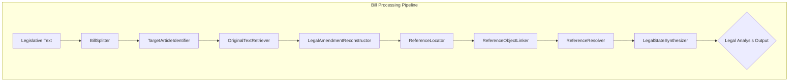

# Bill Parser Engine: Pipeline Overview & Current Status

_Last updated: 2024-06-22_

## 1. Introduction: The Lawyer's Mental Model

The primary goal of this pipeline is to automate the analysis of French legislative amendments by mirroring the mental model of an expert lawyer. When a lawyer analyzes a bill, they don't just read the new text; they interpret it as a set of precise instructions for modifying an existing legal document.

The core principle is to produce a clear, comparative "diff" of the law. The final output is not a single, flattened text but two distinct, fully-resolved legal states focused on the specific parts being amended:

1.  **`BeforeState`**: The specific text fragment that is being changed or removed, with all its references resolved to provide the concrete legal meaning of what is being modified. _Note: For INSERT operations where new content is added, the BeforeState may be empty or contain only the insertion point context._
2.  **`AfterState`**: The specific modified text fragment that replaces the original, with all its new references resolved to show the precise legal meaning after the amendment. _This includes both MODIFIED content (replacements) and INSERTED content (new additions)._

This focused approach mirrors how lawyers actually work - they concentrate on the specific changes with enough context to understand the legal implications, rather than analyzing entire legal documents. When lawyers encounter a reference, they don't read entire regulations; they ask specific questions like "What does 'producteurs' mean in this context?" and extract only the relevant definition. This question-guided resolution approach ensures that every component in the pipeline has a simple, well-defined purpose, which is essential for building a robust and accurate system.

**Important**: The pipeline fully supports all types of legislative operations:

- **MODIFY/REPLACE**: Changing existing legal text
- **INSERT/ADD**: Adding new legal provisions
- **DELETE**: Removing existing legal text

## 2. Visual Pipeline Architecture

This diagram illustrates the flow of data from raw legislative text to the final, analyzable output.

## 3. Component-by-Component Breakdown

Here is the status and role of each component in the pipeline.

---

### **Step 1: BillSplitter**

- **File**: `bill_parser_engine/core/reference_resolver/bill_splitter.py`
- **Purpose**: To deterministically parse the raw legislative bill into atomic, manageable `BillChunk` objects based on the document's hierarchy (TITRE, Article, I, 1°, a), etc.).
- **Inputs**: Raw legislative text (string).
- **Outputs**: A list of `BillChunk` data objects.
- **Implementation**: This is a **rule-based** component using regular expressions. It does not use an LLM, ensuring its output is deterministic and reliable.
- **Status**: **Implemented and stable.** It correctly preserves the hierarchical context for each chunk, which is critical for downstream components.

---

### **Step 2: TargetArticleIdentifier**

- **File**: `bill_parser_engine/core/reference_resolver/target_identifier.py`
- **Purpose**: For each `BillChunk`, to identify the primary legal article that the amendment intends to modify (e.g., "Article L. 254-1" of the "code rural et de la pêche maritime").
- **Inputs**: A `BillChunk` object.
- **Outputs**: A `TargetArticle` data object containing the operation type (MODIFY, INSERT, DELETE, etc.), code, and article identifier.
- **Implementation**: Uses the **Mistral API in JSON Mode** to extract structured data from the chunk's text and context.
- **Status**: **Implemented and stable.** Correctly identifies all operation types including INSERT operations for new articles/provisions.

---

### **Step 3: OriginalTextRetriever**

- **File**: `bill_parser_engine/core/reference_resolver/original_text_retriever.py`
- **Purpose**: To fetch the full, original text of the `TargetArticle` identified in the previous step. This is crucial because amendment text often refers to parts of the original law that are not explicitly quoted.
- **Inputs**: A `TargetArticle` object.
- **Outputs**: The original law article text (string) and retrieval metadata.
- **Implementation**: A hybrid approach using the `pylegifrance` library first, with a fallback to web search. It is integrated with `cache_manager.py` for performance.
- **Status**: **Implemented and stable.**

---

### **Step 4: LegalAmendmentReconstructor**

_(Note: This corresponds to `TextReconstructor` in the spec)_

- **File**: `bill_parser_engine/core/reference_resolver/legal_amendment_reconstructor.py`
- **Purpose**: To mechanically apply the amendment instruction from a `BillChunk` to the `OriginalLawArticle` text. This is a critical step that prepares the text for reference analysis.
- **Inputs**: The original law article text (string) and a `BillChunk` object.
- **Outputs**: A `ReconstructorOutput` object containing:
  1. `deleted_or_replaced_text`: The exact text removed from the original (empty for INSERT operations).
  2. `intermediate_after_state_text`: The full text of the article _after_ the change.
  3. `newly_inserted_text`: Text that was added or inserted (for INSERT/ADD operations).
- **Implementation**: This component is a mini-pipeline itself, composed of `InstructionDecomposer`, `OperationApplier`, and `ResultValidator` to perform the reconstruction robustly. **Fully supports INSERT operations** where original text may be empty and new content is being added.
- **Status**: **Implemented and stable.** The separation of "deleted", "after", and "newly inserted" text fields ensures all operation types (MODIFY, INSERT, DELETE) are handled correctly.

---

### **Step 5: ReferenceLocator**

- **File**: `bill_parser_engine/core/reference_resolver/reference_locator.py`
- **Purpose**: To scan the two text fragments from the reconstructor and locate all normative reference strings (e.g., "au 3° du II", "du règlement (CE) n° 1107/2009").
- **Inputs**: A `ReconstructorOutput` object.
- **Outputs**: A list of `LocatedReference` objects. Each is tagged as **`DELETIONAL`** (if found in the deleted text) or **`DEFINITIONAL`** (if found in the new text).
- **Implementation**: Uses the **Mistral API in JSON Mode**. By scanning only the small text fragments, it is highly efficient.
- **Status**: **Implemented and stable.**

---

### **Step 6: ReferenceObjectLinker**

- **File**: `bill_parser_engine/core/reference_resolver/reference_object_linker.py`
- **Purpose**: To take each located reference and grammatically link it to the specific noun or concept it modifies (its "object"). This component also generates a `resolution_question` to guide the subsequent content extraction.
- **Inputs**: The list of `LocatedReference` objects and the appropriate context text (original article for DELETIONAL, new text for DEFINITIONAL).
- **Outputs**: A list of `LinkedReference` objects, now enriched with the grammatical `object` and a targeted `resolution_question`.
- **Implementation**: Uses the **Mistral API with Function Calling** for precise, grammar-aware analysis and question generation.
- **Status**: **Implemented and stable.** Creates the foundation for question-guided resolution in the next step.

---

### **Step 7: ReferenceResolver (Current Focus)**

- **File**: `bill_parser_engine/core/reference_resolver/reference_resolver.py`
- **Purpose**: To resolve linked references through **question-guided content extraction**. Instead of returning entire legal documents, this component answers specific questions about referenced objects.
- **Two-Step Process**:
  1. **Content Retrieval**:
     - DELETIONAL references: Extract from the original article text (already available)
     - DEFINITIONAL references: Fetch external content using `OriginalTextRetriever`
  2. **Question-Guided Extraction**: Use the `resolution_question` field to extract only the relevant answer from the retrieved content
- **Example**:
  - Reference: "du 11 de l'article 3 du règlement (CE) n° 1107/2009"
  - Object: "producteurs"
  - Question: "What is the definition of 'producteurs' according to paragraph 11 of article 3?"
  - Result: Only the specific definition paragraph, not the entire EU regulation
- **Inputs**: A list of `LinkedReference` objects (each containing a `resolution_question`) and the original article text.
- **Outputs**: A `ResolutionResult` containing resolved references with focused, question-specific content.
- **Implementation**: Uses different retrieval strategies for DELETIONAL vs DEFINITIONAL references, followed by LLM-based targeted extraction guided by resolution questions.
- **Status**: **Ready for implementation.** This approach dramatically improves synthesis accuracy and efficiency by providing precisely the information needed to understand each referenced object.

---

### **Step 8: LegalStateSynthesizer**

- **File**: `bill_parser_engine/core/reference_resolver/legal_state_synthesizer.py`
- **Purpose**: The final step. It takes the resolved references with their question-specific content and intelligently substitutes them back into the "before" and "after" text fragments to create fully interpretable legal states.
- **Inputs**: The `ResolutionResult` (containing focused, answer-specific content) and the `ReconstructorOutput`.
- **Outputs**: The final `LegalAnalysisOutput` containing the fully resolved `BeforeState` and `AfterState` strings.
- **Implementation**: Uses the **Mistral API in JSON Mode** to perform the substitution while maintaining grammatical correctness and readability. Benefits from receiving focused content rather than entire articles, making synthesis more accurate and efficient.
- **Status**: **Implemented.**

## 4. Conclusion and Next Steps

The pipeline is well-structured, and most of its components are stable and reflect the architectural vision. The core logic of separating text reconstruction from reference analysis is sound and provides significant benefits for accuracy and efficiency.

The immediate next step is to **implement the `ReferenceResolver`** with its question-guided extraction approach. This component will complete the end-to-end data flow by providing targeted, answer-focused content resolution rather than full-text retrieval. The key innovation is using the `resolution_question` field from `LinkedReference` objects to extract precisely the information needed to understand each referenced object, enabling efficient and accurate legal state synthesis.
